<div align="center">

# Hi there, I'm Kyuhyun Byun 👋


</div>

---

<div align="center">

### 🌐 Connect with Me

[](https://novemberde.github.io/)
[](https://www.linkedin.com/in/novemberde/)
[](https://github.com/novemberde)

</div>

---

## 🚀 About Me

```go
type Engineer struct {
    Name       string
    Location   string
    Roles      []string
    Focus      []string
    Expertise  Expertise
    Philosophy string
}

type Expertise struct {
    Languages    []string
    MLOps        []string
    Backend      []string
    Architecture []string
}

var me = Engineer{
    Name:     "Kyuhyun Byun",
    Location: "Seoul, Korea 🇰🇷",
    Roles:    []string{"Software Engineer", "MLOps Engineer", "Gopher", "AWS Serverless Hero"},
    Focus:    []string{"Backend Development", "MLOps", "Distributed Systems"},
    Expertise: Expertise{
        Languages:    []string{"Go", "Python", "TypeScript", "Node.js"},
        MLOps:        []string{"ML Pipeline", "Model Deployment", "Monitoring", "CI/CD"},
        Backend:      []string{"Microservices", "API Design", "Event-Driven Architecture"},
        Architecture: []string{"Serverless", "Container Orchestration", "Cloud-Native"},
    },
    Philosophy: "Simplify complexity, automate everything 🤖",
}
```

---

## 💻 Tech Stack

<div align="center">

### 💾 Languages & Frameworks


### 🤖 MLOps & DevOps


### ☁️ Cloud & Infrastructure


</div>

---

## 📊 GitHub Metrics

<div align="center">



</div>

---

## 🏆 Highlights

<div align="center">

📝 **Technical Blogger** - Sharing knowledge and insights on software engineering

🎯 **Open Source Contributor** - Building tools and solutions for the community

🌟 **AWS Serverless Hero** - Recognized for contributions to the serverless community

</div>

---

## 💡 Fun Facts

- 🔭 I'm passionate about **Go programming** and **building scalable backend systems**
- 🤖 Working with **MLOps pipelines** and **machine learning deployment**
- 🌱 Always learning and exploring **distributed systems** and **best practices**
- 💬 Ask me about **Go**, **microservices**, **ML pipelines**, and **serverless architecture**
- ⚡ I believe in **automating everything** and **infrastructure as code**
- 📚 I enjoy sharing knowledge through **blogging** and **community engagement**

---

<div align="center">

### 📈 Profile Stats


---

💼 **Open to collaborating on interesting serverless projects!**

⭐️ From [novemberde](https://github.com/novemberde)

</div>
